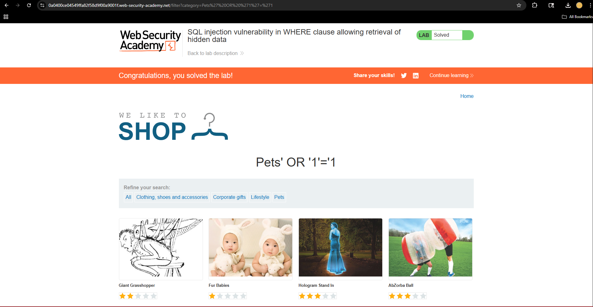

## Example Output

### Before Injection

### After Injection

## Security Impact
- Exposure of hidden data
- Unauthorized data access
- Potential authentication bypass

## Prevention
- Use parameterized queries
- Validate and sanitize input
- Use prepared statements

## Key Takeaways
This project demonstrates how improper input handling can lead to serious security vulnerabilities and highlights the importance of secure coding practices.
