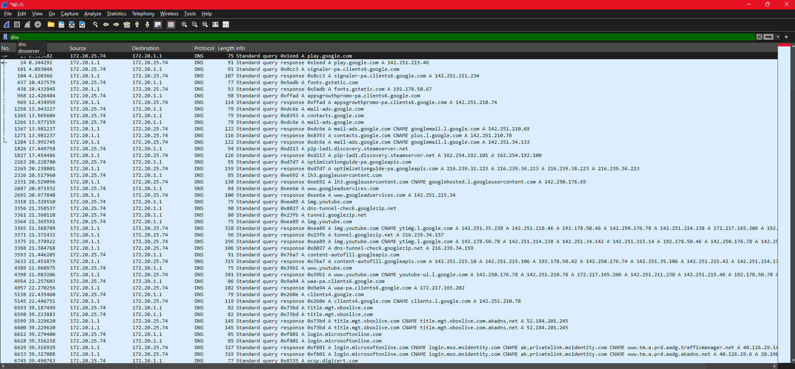
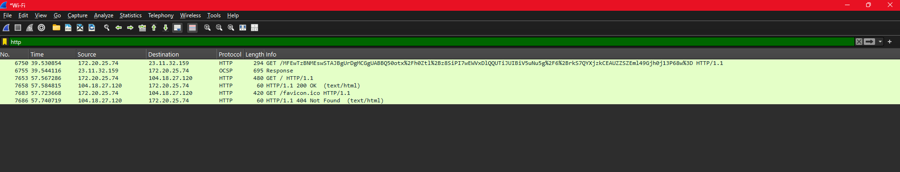
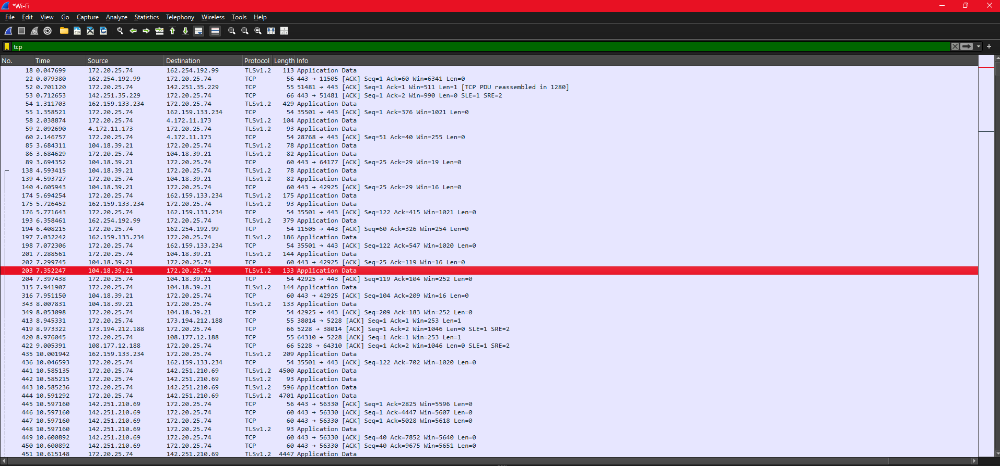

# Wireshark Traffic Analysis

## Overview
This project demonstrates capturing and analyzing real network traffic using Wireshark. The goal is to understand how different protocols operate and how data flows across a network.

## Tools Used
- Wireshark

## Activity
- Captured live network traffic on a Wi-Fi interface
- Generated traffic by browsing websites
- Applied filters to isolate DNS, HTTP, and TCP traffic

## Key Observations

### DNS Traffic
DNS queries show how domain names are resolved into IP addresses before communication begins.

### HTTP Traffic
HTTP requests demonstrate how a client communicates with a web server using GET requests and receives responses.

### TCP Traffic
TCP packets show how connections are established and maintained between systems, including acknowledgments and data transfer.

## Security Relevance
Analyzing network traffic helps identify suspicious behavior, detect anomalies, and understand how attackers may interact with systems.

## Key Takeaways
Wireshark provides deep visibility into network communications and is an essential tool for network analysis and cybersecurity.
